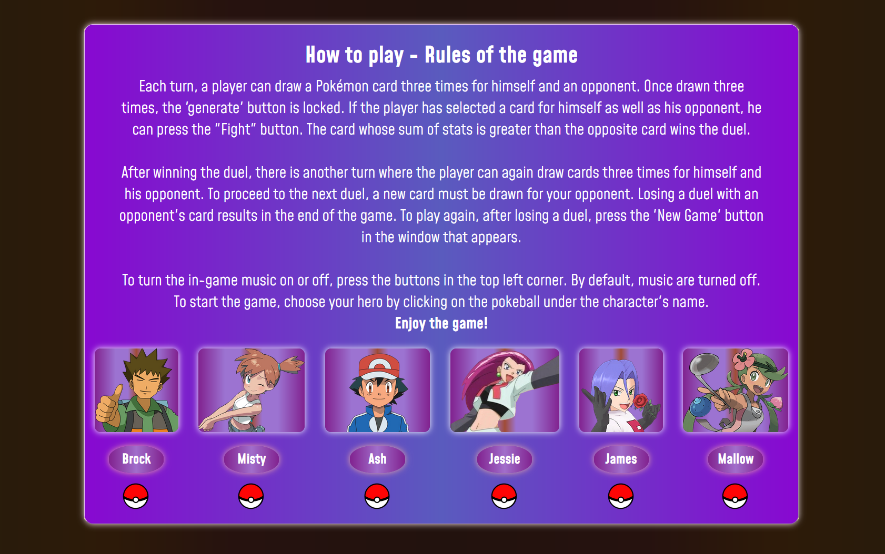
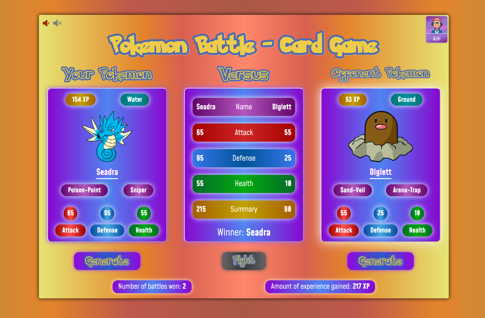

# Pokemon-Card-Game

**Hello!**

This is my next project **(the the most interesting for me in JavaScript to that point)**, thanks to which I have increased my skills and knowledge of JavaScript.

The project is a card game in which the player faces off against an opponent. **The rules of the game are posted in the game, once it is launched in the browser.**
The game uses the **Pokemon API**, from which images and Pokemon stats are generated.

## Screenshots

## 🔗 Live Site
[Live Site Here!](https://camillematernacci.github.io/Pokemon-Card-Game/)

## 🛠 Technologies used

     

